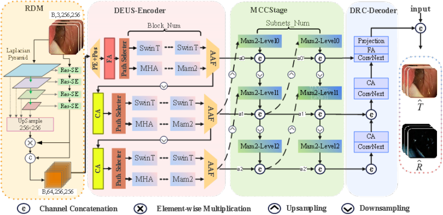

## MTRSNet 内镜图像与视频反射去除网络

---

### 演示
---
<p align="center">
  
</p>

### 简介
---

给定原始内镜图像，我们首先通过拉普拉斯金字塔提取多尺度高频反射特征；其次使用 Residual-SE 层对原图和反射先验的特征进行提取与压缩。两路特征融合并拼接为 64 通道张量。

该张量进入双分支协同编码器：
- **Mamba 路径**：高效的状态空间模型，通过四方向扫描和输入自适应离散化来建模长程依赖
- **Swin-Transformer 路径**：保留局部高频细节的注意力机制

训练过程中采用自调度策略平衡两分支贡献，其输出由逐像素注意力聚合器融合，对易受镜面高光影响的细纹理像素赋予更大权重。

融合后的多尺度表示进入多级跨反馈收敛阶段（MCCS），特征通过上/下采样反馈链在子网络与不同深度间传播，促成全局语境与局部结构的一致性，将最丰富的语义集中到最深层节点。

最后，双路径仿射残差耦合解码器（DP-ARCD）逐级融合层次特征，联合估计透射和反射分量的残差。预测的残差经可学习因子缩放后加回输入，得到无反射的透射层输出 T 以及对应的反射层 R。整个流程中，四方向 Mamba 模块采用核融合的 CUDA/Triton 算子以减少片外 I/O，确保在高分辨率内镜图像上既高效又有效地实现 T 与 R 的完全解耦。

<p align="center">
  
</p>

### 运行环境
---
- **Ubuntu**: 22.04
- **Python**: 3.10
- **PyTorch**: 2.6.0
- **CUDA**: 12.4

### 安装
---
安装依赖库：
```
pip install opencv-python pillow matplotlib scikit-image scipy pyyaml tqdm tabulate ipdb tensorflow timm triton accimage
```

[安装 Mamba-ssm 和 causal-conv1d](https://github.com/state-spaces/mamba/issues/808#issuecomment-3719102259)

### 数据集与准备
---

**可用数据集：**
- [HyperKavsir](https://github.com/researchmm/STTN) - 内镜数据集
- [MouseData](https://drive.google.com/file/d/1eOiaGrRYSL9kGgwFj9ZiFTTTD60mahUQ/view?usp=sharing) - 小鼠数据集

**数据集说明：**
- **HyperKavsir**：使用 `HyperKDataset` 接口，需要经过帧间修复得到对应的 input-label 对
- **MouseData**：使用 `DSRTestDataset` 接口，可直接使用

### 训练超参数
---
1. 数据集配置参数

| 参数名 | 类型 | 默认值 | 说明 |
|--------|------|--------|------|
| `data_root` | str | `'./data'` | 数据根目录路径 |
| `batch_size_train` | int | 1 | 训练批次大小 |
| `batch_size_test` | int | 4 | 测试批次大小 |
| `shuffle` | bool | True | 是否打乱数据 |
| `num_workers` | int | 0 | 数据加载线程数 |
| `sampler_size1-5` | int | 取决于training | 各数据源采样大小 |
| `test_size` | list | [200, 0, 0, 0, 200, 200] | 各测试集样本数 |

2. 模型训练配置

| 参数名 | 类型 | 默认值 | 说明 |
|--------|------|--------|------|
| `epoch` | int | 121 | 总训练轮数 |
| `base_lr` | float | 1e-4 | 基础学习率 |
| `scheduler_type` | str | 'plateau' | 学习率调度器类型（plateau/cosine） |
| `es_patience` | int | 20 | 早停耐心值（无改进多少个epoch后停止） |
| `es_delta` | float | 1e-4 | 早停最小改进阈值 |
| `es_verbose` | bool | True | 早停是否打印信息 |

3. 路径和文件配置

| 参数名 | 类型 | 默认值 | 说明 |
|--------|------|--------|------|
| `model_dir` | str | `'./model_fit'` | 模型保存目录 |
| `save_dir` | str | `'./results'` | 结果保存目录 |
| `model_path` | str | `'./model_118.pth'` | 加载模型检查点路径 |
| `reset_best` | bool | False | 是否重置最佳模型记录 |

4. 调试和监控配置

| 参数名 | 类型 | 默认值 | 说明 |
|--------|------|--------|------|
| `always_print` | int | 0 | 是否总是打印信息 |
| `debug_monitor_layer_stats` | int | 0 | 是否监控层统计信息 |
| `debug_monitor_layer_grad` | int | 0 | 是否监控层梯度 |
| `display_id` | int | -1 | 显示ID（用于可视化） |
| `host` | str | '127.0.0.1' | 主机地址 |
| `port` | int | 57117 | 端口号 |
| `throttle_ms` | int | 0 | 每次优化器步后的睡眠毫秒数 |

5. 功能开关配置

| 参数名 | 类型 | 默认值 | 说明 |
|--------|------|--------|------|
| `training` | bool | False | 是否为训练模式 |
| `color_enhance` | bool | False | 是否启用颜色增强 |
| `AdditionSkip_en` | bool | True | 是否启用额外跳过连接 |

6. 学习率映射配置（decoder特定）

| 模块名 | 学习率 | 说明 |
|--------|--------|------|
| `token_decoder3` | 9.9e-05 | 最后一层解码器学习率 |
| `token_decoder2` | 9.9e-05 | 第三层解码器学习率 |
| `token_decoder1` | 9.9e-05 | 第二层解码器学习率 |
| `token_decoder0` | 9.9e-05 | 第一层解码器学习率 |


### 训练
---

运行 `train.py` 可以开始模型训练。运行前需要执行以下步骤：

**步骤 1**：在 `MTRR_option.py` 中修改训练参数

**步骤 2**：在 `train.py` 中填入 MouseData 与 HyperKavsir 的数据路径和索引文件路径，然后运行。其他数据集默认不参与训练

`train.py` 运行后将自动生成以下目录和文件：

```
./indexcsv/                       # CSV 日志文件目录
  ├── {时间戳}_train_loss.csv    # 训练损失日志（每个 epoch）
  └── {时间戳}_index.csv         # 验证指标（PSNR, SSIM, LMSE, NCC）

./model_fit/                      # 模型检查点目录
  ├── model_latest.pth            # 最新模型
  └── model_{epoch}.pth           # 各 epoch 的模型

./img_results/                    # 可视化结果目录
  ├── output_train_{时间戳}/      # 训练过程的生成图像
  └── output_test_{时间戳}/       # 测试过程的生成图像
```

**训练过程中每个 epoch 显示的内容：**
- 当前 epoch 和 batch 的实时进度条
- 实时损失值：loss、mseloss、vggloss、ssimloss、loss_spr
- 当前学习率
- 验证指标：PSNR、SSIM、LMSE、NCC
- 早停警告
- 模型保存状态


### 推理
---

运行 `inference.py` 可以进行模型推理。运行前需要准备：

**准备 1**：模型检查点文件（.pth）
- 通过 `--ckpt` 参数指定，或在 `MTRR_option.py` 中配置 `model_path`
- 用于加载训练好的 MTRSNet 模型权重

**准备 2**：数据集路径（代码中硬编码）
- 织物实时数据：`/home/hostname/hostname-MTRRVideo/data/tissue_real` 及其索引文件
- 训练集索引：`train1.txt`（800 张样本）
- 测试集索引：`eval1.txt`（200 张样本）

**推理命令示例：**
```bash
python inference.py --ckpt ./model_fit/model_latest.pth --outdir ./infer_outputs
```

`inference.py` 运行后会在 `./infer_outputs/output_infer_{时间戳}/` 目录下生成：

**1. 透射层预测图像**
- 文件名：`{num:04d}-grid_fakeT.png`
- 说明：预测的透射图像（已进行直方图匹配增强处理）
- 排列：4 张图像/行的网格排列

**2. 原始输入图像**（可选）
- 文件名：`{num:04d}-grid_input.png`
- 说明：输入的原始混合图像

**3. 反射层预测图像**（仅当指定 `--save-reflection` 时）
- 文件名：`{num:04d}-grid_fakeR.png`
- 说明：预测的反射分量

### 可视化
---

可视化结果如上文所述，在训练和推理过程中自动生成并保存。

### 项目结构
---

**MTRSNetv2 项目完整目录说明**

```
项目根目录 (./)
├── 【训练与推理脚本】
│   ├── train.py                    - 主训练脚本，用于训练MTRSNet模型
│   ├── inference.py                - 推理脚本，用于在数据集上进行预测
│   ├── debug_train.py              - 调试训练脚本
│   └── classifier.py               - 分类器相关代码
│
├── 【模型架构文件】
│   ├── MTRSNet.py                  - MTRSNet主模型架构和引擎类
│   ├── MTRR_RD_modules.py          - MTRR R-D模块实现
│   ├── MTRR_token_modules.py       - MTRR令牌模块实现
│   ├── vmamba.py                   - VMamba模型相关实现
│   └── reverse_function.py         - 反向函数实现
│
├── 【配置与选项】
│   ├── MTRR_option.py              - 训练选项配置（学习率、batch_size等）
│   └── set_seed.py                 - 随机种子设置
│
├── 【损失函数】
│   ├── customloss.py               - 自定义损失函数
│   └── psdLoss/                    - 专有损失函数包
│       ├── losses.py               - 主损失函数定义
│       ├── focal_loss.py           - Focal损失
│       ├── lovasz_losses.py        - Lovász损失
│       ├── ssim.py                 - SSIM损失
│       ├── vgg.py                  - VGG特征提取损失
│       ├── spec_loss_pack.py       - 镜面反射损失包
│       └── CX/                     - 上下文损失模块
│           ├── CX_distance.py
│           ├── CX_helper.py
│           └── enums.py
│
├── 【数据集处理】
│   └── dataset/                    - 数据集加载与预处理
│       ├── new_dataset1.py         - 数据集类定义
│       ├── quality_index.py        - 图像质量评估指标
│       ├── transforms.py           - 数据增强变换
│       ├── torchdata.py            - PyTorch数据加载器
│       ├── image_folder.py         - 图像文件夹读取
│       ├── hook.py                 - 数据加载钩子
│       └── util.py                 - 数据处理工具函数
│
├── 【工具函数】
│   ├── util/                       - 通用工具模块
│   │   ├── color_enhance.py        - 颜色增强和直方图匹配
│   │   ├── eval_util.py            - 评估工具函数
│   │   ├── csv.py                  - CSV文件写入工具
│   │   ├── cupcut.py               - 图像裁剪工具
│   │   └── video_grip.py           - 视频处理工具
│   ├── core/                       - 核心工具
│   │   └── utils.py                - 通用工具函数
│   ├── rcmap_mask_fusion.py        - 反射率图掩码融合
│   ├── video_func.py               - 视频处理函数
│   └── early_stop.py               - 早停机制实现
│
├── 【性能与分析】
│   ├── calc_flops_test.py          - FLOPS计算测试
│   ├── calc_throughout.py          - 吞吐量计算
│   └── flops.md                    - FLOPS分析文档
│
├── 【批量处理】
│   └── batch_zip_infer.py          - 批量推理脚本
│
├── 【文档】
│   ├── README_cn.md                - 中文说明文档
│   └── README_en.md                - 英文说明文档
│
├── 【资源目录】
│   └── assert/                     - 资源文件目录
│
└── 【版本控制】
    ├── .git/                       - Git 版本控制目录
    └── .gitignore                  - Git 忽略配置文件
```

### 文件功能速查表
---

**核心训练流程：**
```
train.py → MTRR_option.py → MTRSNet.py → psdLoss/
```

**推理流程：**
```
inference.py → MTRSNet.py → dataset/new_dataset1.py
```

**数据处理管道：**
```
dataset/new_dataset1.py → dataset/transforms.py → dataset/quality_index.py
```

**损失函数体系：**
```
customloss.py → psdLoss/losses.py + psdLoss/ssim.py + psdLoss/vgg.py
```

**配置参数管理：**
```
MTRR_option.py (学习率映射、优化器、调度器配置)
```

**评估与监控：**
```
quality_index.py (PSNR/SSIM/LMSE/NCC) + eval_util.py + early_stop.py
```

### 快速开始
---

**1. 训练模型**
```bash
python train.py --epoch 150 --base_lr 1e-4 --scheduler_type plateau
```

**2. 单数据集推理**
```bash
python inference.py --ckpt ./model_fit/model_latest.pth --outdir ./infer_outputs
```

**3. 批量推理**
```bash
python batch_zip_infer.py
```

**4. 性能分析**
```bash
python calc_flops_test.py
python calc_throughout.py
```

### 联系方式
---

如有任何问题或建议，欢迎通过以下方式联系我们：

📧 **邮箱**：luanjingmin@neuq.edu.cn


